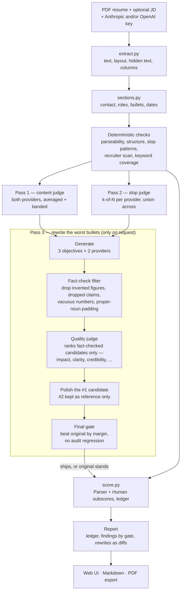

# resume.diagnostics

A local resume checker for mid-level AI Engineer roles. Upload a PDF, get a list
of specific defects — each with the line it is on, the fix, and what it cost the
score.

```bash
python -m venv .venv && .venv/bin/pip install -r requirements.txt
.venv/bin/uvicorn app:app --reload
# http://127.0.0.1:8000
```

Works with no API key at all. Keys unlock judgement, not the tool.

## What this is not

It does not tell you how to beat a bot, because that is not what happens. Most
ATSs do not auto-reject on resume content — in a poll of 630 recruiters, 83% said
theirs does not. Greenhouse and Lever are built around human scorecards.

It also does not give you a portable "ATS score". The same resume scores
differently in Workday, Lever and Greenhouse, and no public checker is calibrated
against interview outcomes — there is no ground truth, so every vendor invents a
rubric and normalises it to 0–100. That is why three free checkers give you three
wildly different numbers.

So the composite here is a **diagnostic index over named defects**, never a
prediction. Every point traces to a finding with its evidence and its cost, the
ledger sums to the total, and you can disagree with any weight and see exactly
what changes. If you only ever read the findings and ignored the number, the tool
would still work.

## Two gates

A resume clears two, and they fail for unrelated reasons:

| Gate | Question | Typical failure |
|---|---|---|
| **Parser** | Can an ATS extract your fields? | Two columns, tables, hidden text, content in the header band |
| **Recruiter** | Does a human learn what you are in seconds? | Best evidence below the fold; Interests above Experience |
| **Hiring manager** | Did the work actually happen? | No eval methodology, no scale, no named model |

Findings and subscores are labelled by gate, because a resume can pass one and
fail the other and the fixes are unrelated.

## How it works

Everything mechanically checkable runs in Python, free and reproducible. The LLM
only judges what rules cannot, and only pass 3 (rewrite) ever generates anything —
passes 1 and 2 only judge, so there's nothing there for a model to game.



Pass 3's four stages are covered in detail under **Rewrites invent nothing** below;
the two gates the deterministic checks split into are covered under **Two gates**
above.

### Deterministic (no key needed)

- **Parseability**, from PDF geometry rather than text: hidden/invisible text,
  empty text layer, column gutters, tables, header-band content, page count.
- **Structure**: sections, dates, reverse-chronological order, gaps, bullet counts.
- **Bullet invariants**: every bullet checked for Outcome, Measurability,
  Mechanism, Ownership — independently, so strong bullets pass in any construction.
- **Slop patterns** ported from [`no-ai-slop`](https://github.com/petergyang/no-ai-slop),
  scoped to resume form, including the portability test.
- **Recruiter scan** using page-1 word boxes: what is actually above the fold.
- **Keywords**: coverage, stuffing penalties, unsupported claims, JD gap diff.

### Three LLM passes

| # | Pass | Job |
|---|---|---|
| 1 | Content | Substance, ownership, seniority fit, missing information |
| 2 | Slop | Named patterns beyond regex reach — never an AI-likelihood score |
| 3 | Rewrite | Generates, fact-checks, ranks, and polishes fixes for both content and slop in one edit, after seeing both |

1 and 2 run concurrently; 3 depends on both, so a rewrite cannot reintroduce the
phrasing pass 2 flags.

**Pass 3 never runs automatically.** Uploading a resume only scores it (passes 1
and 2). A "Generate rewrite suggestions" button appears once the score is in —
generation is a second, explicit request, so you always know when the extra calls
are being spent and never pay for rewrites you didn't ask to see.

## Two API keys

Supply both an Anthropic and an OpenAI key and the tool ensembles across them.
This is worth more than sampling one model repeatedly, because **a model is
weakest at flagging its own idiom** — if your resume was drafted with one, the
other is the informative detector.

That inverts the combination rule, which is the subtle part:

- **One model, N samples** — a lone finding is probably sampling noise → keep
  findings seen in *k of N*.
- **Two providers** — a lone finding is plausibly a blindspot catch → keep the
  *union*, labelled `1 of 2 models`.

Getting that backwards would either flood you with false positives or discard
exactly the catches that make two keys worth having.

Either key alone works. Neither still runs every deterministic check.

## Rewrites invent nothing

Rewrites are proposals in a diff. Nothing is applied automatically.

Where a bullet needs a number you never supplied, you get `[add: eval metric]`,
not a plausible figure. A fabricated stat is not a style error — it is something
you have to defend in an interview.

This is enforced, not just prompted. There's no ground truth for "the best resume
bullet" the way there is for a factual claim, so pass 3 doesn't try to verify
candidates into a winner — it treats picking one as **constrained optimization**:
generate diverse options, throw out anything that fails the fact-check, then judge
quality only among what's left.

1. **Generate** under three objectives — mechanism-led, outcome-led, ownership-led
   (the same invariants scoring already checks) — from both providers, so
   candidates differ in framing, not just in luck from resampling one prompt.
2. **Fact-check filter.** Every candidate runs through the audit set (below) before
   anything judges its quality. A candidate that invents a figure or drops a claim
   is discarded outright — it never gets an opinion on how good it sounds.
3. **Quality judge.** One model ranks the surviving, fact-checked candidates on
   impact, specificity, technical depth, clarity, credibility, and ATS relevance —
   ranked, not scored, since absolute 1–10 ratings from an LLM aren't calibrated
   enough to sum into a formula. Told explicitly not to reward buzzwords or
   inflated claims.
4. **Polish the winner.** A single light edit pass on the #1 candidate, allowed to
   see the runner-up only as a reference for phrasing it can borrow — never to
   blend the two into a claim neither made. This is deliberately *not*
   mixture-of-agents-style synthesis-from-everything: blending several candidates'
   "strengths" is exactly how phrases like "cutting-edge ecosystem" get
   manufactured, and manufacturing slop is what the rest of this project exists to
   catch.
5. **Final gate.** The polished bullet (and, as a fallback, the unpolished winner)
   both go through the same verifier as plain best-of-N — see below. Polishing can
   only win by clearing it; if it doesn't, the unpolished winner ships instead.

The final gate is a textbook Goodhart setup — selecting against a proxy invites
gaming it — so the verifier is **split**:

- **Ranking set** — the invariants, slop patterns, and length used above.
- **Audit set** — never used for ranking, only to detect gaming: invented
  figures, vacuous numbers (`collaborated with 3 engineers`), truncation, and
  proper-noun padding.

A candidate cannot optimise against signals it is not selected on, so a rising
ranking score with a falling audit score is the hacking signature — logged per run
and asserted in tests. The winning bullet must also beat the **original** by a
margin, not merely beat its siblings; if nothing does, you keep your bullet.

Run `python scripts/hacking_sweep.py` to see the ceiling check: raising N must not
degrade the audit. The quality judge and polish step cost two extra calls total per
run (not per bullet — both are single batched calls), so they're on by default and
in Thorough mode, off in Economy — toggle `[ensemble].rewrite_judge` in
`ats/weights.toml` if you want fact-checked best-of-N without them.

## Where the rubric comes from

There is **no published "gold standard" resume** from Anthropic, OpenAI, or any
FAANG. What circulates under that name is vendor SEO content, much of it itself
LLM-generated — calibrating on it would tune the slop detector toward the exact
phrasing it exists to catch.

So weights are derived from the **demand side**: `corpus/jds/` holds AI Engineer
postings, and `scripts/build_taxonomy.py` measures term frequency across them to
generate `ats/taxonomy.json`. A weight the corpus does not support is visibly
wrong and correctable.

> **Corpus caveat, read this.** The shipped corpus files are *synthesized
> composites*, not verbatim postings — the environment that built this could not
> reach careers sites. They are grounded in published 2026 hiring analyses, but
> they are a defensible starting point, not a substitute for real data. Drop real
> postings into `corpus/jds/` and re-run the script. See `corpus/README.md`.

### Your personal JD corpus

The generic corpus above is a reasonable prior for "a mid-level AI Engineer role"
in the abstract. It's not a substitute for the roles you're actually targeting. If
you paste in real postings you're interested in, they *replace* the generic
taxonomy for your runs — not another keyword diff bolted on top.

```
python scripts/add_jd.py             # paste one posting; prompts for title/company/url
python scripts/build_user_corpus.py  # regenerate ats/taxonomy.json + ats/jd_digest.json
```

Free and deterministic — no API key, no LLM call, just regex over text you already
pasted (`ats/jd_sections.py`, `ats/jd_dimensions.py`). Re-run the build script after
every posting; it fully regenerates both files from whatever's currently in
`corpus/jds/user/`, so nothing is ever hand-edited or goes stale. With zero
postings added, it's a no-op — everything behaves exactly as it did before this
existed.

Two different things get extracted, and they feed the report differently:

- **Skill mentions** ("PyTorch" in 5 of 5 postings) → the same keyword-coverage
  weighting the generic corpus produces, just grounded in your real targets.
  Section-aware: a skill named in a posting's *requirements* counts more than one
  that only shows up as *nice-to-have*, and neither counts a mention from the
  benefits/perks boilerplate.
- **Dimension signals** ("own production systems end-to-end" → ownership; "rigorous
  evals" → evaluation rigor) — phrases that describe scope or seniority rather
  than naming a skill, so they can't be taxonomy terms. These never create a new
  rubric axis. They only scale how much an *existing* rule already costs
  (`config.dimension_multiplier`, applied in `score.py` before the anti-hard-gate
  ceiling, so it can amplify a finding's cost but never let it exceed its
  category's weight). A target role that hammers "own it end-to-end" makes the
  existing ownership-dilution check bite harder on your runs; it doesn't invent a
  new "ownership" category.

Five dimensions are wired in — ownership, production evidence, evaluation rigor,
seniority/autonomy, leadership — each mapped to a rule this project already judges
(see the table in `ats/jd_dimensions.py`). Cross-functional collaboration is
deliberately left out: its natural phrasing ("partnered with product and design")
is close enough to the ownership-dilution pattern ("the team shipped X") that
wiring it in without resolving that collision would reward and penalise the same
sentence shape at once.

### Rule provenance

Every rule declares where its authority comes from:

| Provenance | Meaning |
|---|---|
| `parser-mechanics` | Mechanically verifiable — the text genuinely fails to extract |
| `jd-derived` | Measured in the JD corpus |
| `recruiter-evidence` | Cited external evidence about recruiter behaviour |
| `heuristic` | Author judgment |

**Heuristic rules are capped at minor severity and can never sink a score**, and
are tagged in the UI. Weights live in `ats/weights.toml` — edit them.

### Why not the XYZ formula

"Accomplished X as measured by Y by doing Z" traces to one exec's 2014 advice, not
a Google rubric. Enforcing it as a template would contradict this tool's own
robotic-rhythm detector — one formula across every bullet is an LLM tell — and it
checks shape rather than substance. A bullet can satisfy XYZ perfectly and still
name no model, dataset or eval. The four invariants above are what XYZ is a
delivery vehicle for, checked independently.

## No hard gates

One public checker returns 22/100 for a missing phone number. That measures one
field and reports it as a verdict on the whole document.

Here, no single non-fraud finding may cost more than its category's weight, and it
is asserted in the test suite: two fixtures differing only in a phone number must
score within a few points. The one deliberate exception is hidden-text injection,
which caps the composite — that is a fraud-flag risk to your candidate record, not
a style preference, and the cap is disclosed in the report.

## Exports

Markdown or PDF. The PDF is generated locally with ReportLab — no headless
browser, no hosted service — so it contains only your report. No watermark, no
branding, producer metadata blanked.

## Development

```bash
.venv/bin/python -m pytest              # 92 tests, no network
.venv/bin/python tests/make_fixtures.py # regenerate fixture PDFs
.venv/bin/python scripts/build_taxonomy.py
.venv/bin/python scripts/hacking_sweep.py
```

Fixture PDFs are generated from `tests/make_fixtures.py` rather than checked in,
so the inputs stay readable in review.

## Privacy

Your resume is written to a temp file, analysed, and deleted in a `finally` block.
API keys live in the request only — never written to disk, never logged. Reports
are cached in memory for an hour so re-rendering does not re-bill you.

## Credits

Slop patterns adapted from [`no-ai-slop`](https://github.com/petergyang/no-ai-slop)
by Peter Yang (MIT) — see `vendor/no-ai-slop/`. UI built following Anthropic's
[`frontend-design`](https://github.com/anthropics/skills/tree/main/skills/frontend-design)
skill.
