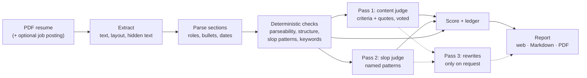

# resume.diagnostics

**A resume checker for AI Engineer roles that explains every point it takes off.**
Upload a PDF and get a list of named defects. Each one comes with the line it is on, the
quote that proves it, a fix, and exactly what it cost the score.


[](LICENSE)


<sub>A sample report with no API key: deterministic checks only. Every row of the ledger on
the left is a real movement of the score, and they sum to the composite.</sub>

**Contents:** [Quickstart](#quickstart) · [Why it exists](#why-it-exists) · [How it works](#how-it-works) · [Evaluation](#evaluation) · [Models and cost](#models-and-cost) · [Project layout](#project-layout) · [Development](#development) · [Limitations](#limitations) · [Privacy](#privacy) · [License](#license)

## Quickstart

```bash
python -m venv .venv && .venv/bin/pip install -r requirements.txt
.venv/bin/uvicorn app:app --reload
# INFO:     Uvicorn running on http://127.0.0.1:8000
```

Open http://127.0.0.1:8000 and upload a PDF.

It works with no API key. An OpenAI key adds the LLM judgement passes; Claude is opt-in
(see [Models and cost](#models-and-cost)).

## Why it exists

Free "ATS score" checkers give the same resume wildly different numbers, because there is
no ground truth: no checker is calibrated against interview outcomes, so each one invents a
rubric and scales it to 0 to 100. This project does not pretend otherwise. Its score is a
**diagnostic index over named defects**, never a prediction. If you ignored the number and
read only the findings, the tool would still work.

## How it works


```mermaid
flowchart LR
    PDF["PDF resume<br/>(+ optional job posting)"] --> EX["Extract<br/>text, layout, hidden text"]
    EX --> SEC["Parse sections<br/>roles, bullets, dates"]
    SEC --> DET["Deterministic checks<br/>parseability, structure,<br/>slop patterns, keywords"]
    DET --> P1["Pass 1: content judge<br/>criteria + quotes, voted"]
    DET --> P2["Pass 2: slop judge<br/>named patterns"]
    P1 --> SCORE["Score + ledger"]
    P2 --> SCORE
    DET --> SCORE
    SCORE --> REP["Report<br/>web · Markdown · PDF"]
    P1 -.-> P3["Pass 3: rewrites<br/>only on request"]
    P2 -.-> P3
    P3 -.-> REP
```

### Rules first, models second

Anything a rule can check runs in plain Python, free and reproducible: hidden text, columns,
tables and header-band content read from the PDF's geometry, plus dates, section order and
known slop patterns. The models only judge what rules can't reach, and two of the three
passes only judge; they never write.

Findings are labelled by the gate they belong to, because a resume can pass one and fail
the other for unrelated reasons:

- **Parser gate.** Can an applicant tracking system extract your fields? Fails on two
  columns, tables, hidden text, content in the header band.
- **Human gate.** Does a recruiter learn what you are in seconds, and does a hiring manager
  believe the work happened? Fails on buried evidence, no eval method, no scale, no named
  model.

### Judges answer questions, not scores

The content judge never picks a number. For each category it answers a handful of yes/no
evidence questions, each with the quote that settles it, and the score is looked up from
those answers. That makes two judges comparable question by question, and it is what the
[evaluation](#evaluation) below measures.

By default one OpenAI model answers three times and the majority wins. Claude can be added
as a second provider, and the rule for combining findings flips when it is: across samples
of one model, a finding seen once is probably noise, so it needs k of N; across two
providers, a finding only one of them saw is plausibly the other's blind spot, so the union
is kept. A model is weakest at spotting its own idiom.

### Rewrites can't invent anything

Pass 3 never runs on upload. It is a separate button, so you always know when extra calls
are being spent. It generates candidates under three framings, drops any that fail a
fact-check before anything judges their quality, ranks the survivors, lightly polishes the
winner, and ships it only if it trips no mechanical check your original bullet passed and,
where your bullet tripped any, clears at least one of them. Where a bullet
needs a number you never gave, you get `[add: eval metric]`, not a plausible figure.

Picking the best of N candidates invites gaming whatever picks them, so the checks are
split. The gate selects on the bullet's own defects going away; a separate audit set
(invented figures, vacuous numbers, padding) is never selected on and only watches for
gaming. A defect fixed while the audit score falls is logged, and a test asserts it is caught.

### Weights come from job postings

The four behaviour categories are weighted by how many of your target postings ask for that
behaviour, so adding a posting moves the weights without anyone editing a number. The rest
are authored in `ats/weights.toml`, and the report shows what each one cost.

The full reasoning for every stage is in [docs/design.md](docs/design.md).

## Evaluation

The content judge is tested by `scripts/agreement_harness.py` on 24 keyed documents from a
30-resume synthetic acceptance set (`corpus/resumes/`), against the owner's hand-labelled
answer key (`corpus/resumes/answer_key.json`).

| Run (30 Sep 2026) | Bar | Sample 0 | Sample 1 | Result |
|---|---|---|---|---|
| gpt-6-luna, high effort, 3-try vote | ≥ 32/36 on each sample | 35/36 | 32/36 | Pass |

How the bar was reached, including the runs that failed (30/36 on both samples at medium
effort, then 31 and 32 at high), is recorded in
[rubric-grounding ticket 15](docs/wayfinder/rubric-grounding/tickets/15-judges-that-repeat-themselves.md).

**What this does and does not show.** The second sample sits exactly on the bar, and the
two samples differ by three, so voting is still noisy. The ruling examples in the prompt
were written from the keyed lines, so this measures instruction-following, not
generalisation to unseen resumes. That check on unseen, real resumes is the next step.

The harness also reports Krippendorff's alpha and how far the voted judge lands from itself on a
rerun, because two judges agreeing on the score nearly every resume gets is coincidence,
not a rubric. `--dry-run` prints the call budget without spending it.

## Models and cost

| Setting | Model | Typical cost per resume |
|---|---|---|
| Default | OpenAI `gpt-6-luna`, content judge voted 3 ways | about $0.03 for the content votes |
| `use_claude = true` in `ats/weights.toml` | adds Claude `claude-sonnet-5` on every pass | about ten times the OpenAI judge's cost per call |
| No key | deterministic checks only | free |

A Claude key alone does not switch Claude on; the setting in `ats/weights.toml` does.

## Project layout

| Path | What it holds |
|---|---|
| `app.py`, `templates/`, `static/` | FastAPI web app and report UI |
| `ats/` | The pipeline: extraction, section parsing, rules, LLM passes, scoring, report |
| `ats/criteria/`, `ats/weights.toml` | The rubric's evidence questions and the authored weights |
| `corpus/jds/` | Job postings that weights and keyword coverage are derived from |
| `corpus/resumes/` | Synthetic acceptance set and the hand-labelled answer key |
| `scripts/` | Evaluation harness, reward-hacking sweep, corpus builders |
| `tests/` | 518 tests; fixture PDFs are generated, not checked in |
| `docs/` | Design notes and the decision log for the rubric work |

## Development

```bash
.venv/bin/python -m pytest                              # 518 tests, no network
.venv/bin/python tests/make_fixtures.py                 # regenerate fixture PDFs
.venv/bin/python scripts/build_taxonomy.py              # regenerate ats/taxonomy.json from corpus/jds/
.venv/bin/python scripts/hacking_sweep.py               # raising N must not degrade the audit
.venv/bin/python scripts/agreement_harness.py --dry-run # judge agreement, call budget only
```

To ground the weights in the roles you are targeting, paste real postings in and rebuild.
This step is free and makes no LLM calls:

```bash
python scripts/add_jd.py             # paste one posting
python scripts/build_user_corpus.py  # regenerate ats/taxonomy.json and ats/jd_digest.json
```

## Limitations

- **The shipped job-posting corpus is synthesized**, not verbatim postings: the
  environment that built it could not reach careers sites. Add real postings with the
  commands above. See `corpus/README.md`.
- **The acceptance set is synthetic.** Real resumes are gitignored and never committed, so
  the published evaluation is on invented documents.
- **No score here predicts interviews.** Nothing public does; see [Why it exists](#why-it-exists).

## Privacy

Your resume is written to a temp file, analysed, and deleted in a `finally` block. API keys
live in the request only; they are never written to disk or logged. Reports are cached in
memory for an hour so re-rendering does not re-bill you. PDF exports are generated locally
with ReportLab, with no watermark and blank producer metadata.

## Credits

Slop patterns adapted from [`no-ai-slop`](https://github.com/petergyang/no-ai-slop) by
Peter Yang (MIT), see `vendor/no-ai-slop/`. UI built following Anthropic's
[`frontend-design`](https://github.com/anthropics/skills/tree/main/skills/frontend-design)
skill.

## License

[MIT](LICENSE). The vendored `no-ai-slop` patterns keep their own MIT license in `vendor/no-ai-slop/`.
